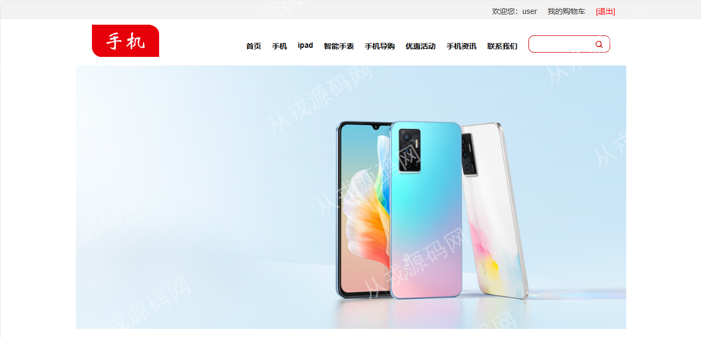
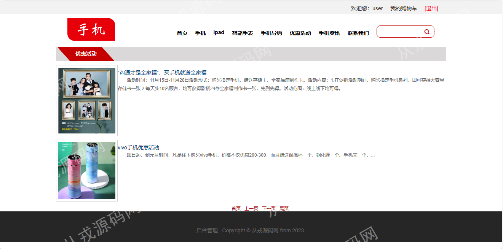
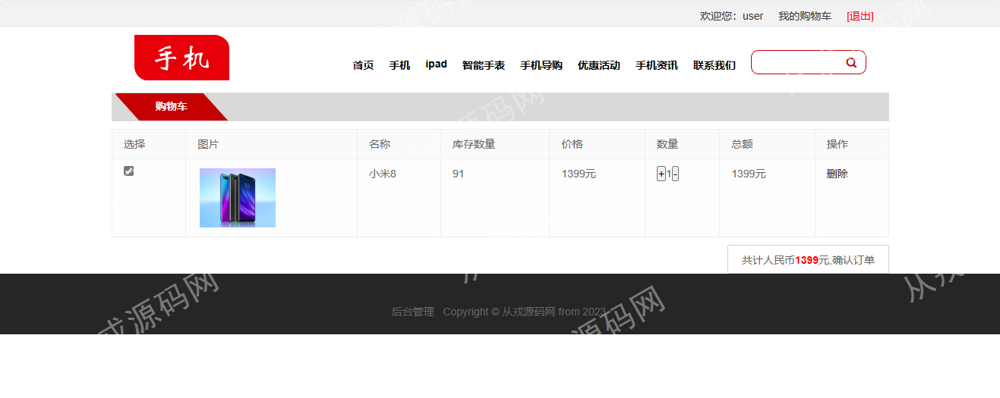
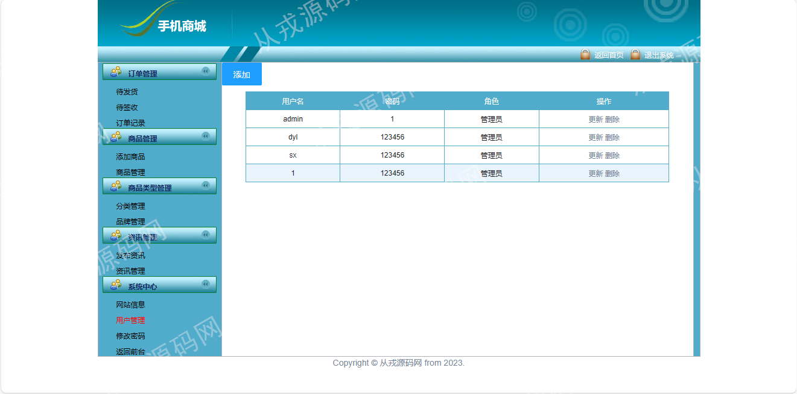
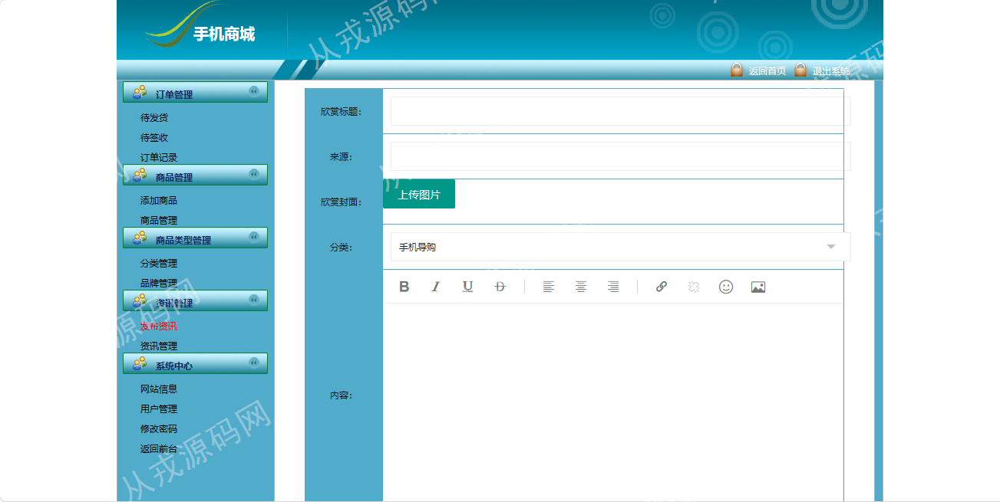

<h1 align="center">53.基于ssm的手机商城管理系统</h1>

- <b>完整代码获取地址：从戎源码网 ([https://armycodes.com/](https://armycodes.com/))</b>
- <b>技术探讨、资料分享，请加QQ群：692619798</b> 
- <b>作者微信：19941326836  QQ：952045282</b> 
- <b>承接计算机毕业设计、Java毕业设计、Python毕业设计、深度学习、机器学习</b>
- <b>选题+开题报告+任务书+程序定制+安装调试+论文+答辩ppt 一条龙服务</b>
- <b>所有选题地址 ([https://github.com/YuLin-Coder/AllProjectCatalog](https://github.com/YuLin-Coder/AllProjectCatalog)) </b>

## 项目介绍
基于ssm的手机商城管理系统：前端jsp、jquery、bootstrap、layui，后端 spring、mybatis，集成订单管理、商品管理、商品类型管理、资讯管理、商品浏览、购物车等功能于一体的系统。

## 功能介绍

### 用户

- 基本功能：登录、注册、退出、资料查看和修改、密码修改
- 首页：广告轮播图、产品推荐、导航栏目、搜索
- 商品功能：商品分类展示、商品详情、加入购物车操作、购物车列表、确认订单、购物车商品删除、购物车商品数量修改
- 我的订单：订单列表、订单明细、订单退订（已签收的订单才可以退订）
- 其他功能：智能手表专栏、手机导购员资料查看、优惠活动列表、优惠活动详情、活动点赞、手机资讯列表、手机资讯详情、联系我们

### 管理员

- 订单管理：订单明细、发货操作、待发货列表、代签收列表、订单记录
- 商品管理：商品信息的增删改查，商品评论，商品信息包含名称、分类、品牌、价格、颜色、大小、库存量、图片、描述信息
- 商品类型管理：分类信息的增删改查，品牌信息的增删改查
- 资讯管理：资讯信息的增删改查，资讯信息包含标题、来源、封面图片、分类、描述信息（富文本编辑）
- 用户管理：用户信息的增删改查
- 网站信息：网站信息查看、网站信息修改、内容支持富文本编辑

## 环境

- <b>IntelliJ IDEA 2009.3</b>

- <b>Mysql 5.7.26</b>

- <b>Tomcat 7.0.73</b>

- <b>JDK 1.8</b>

## 运行截图

